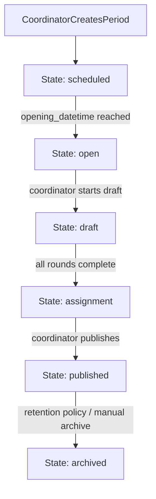
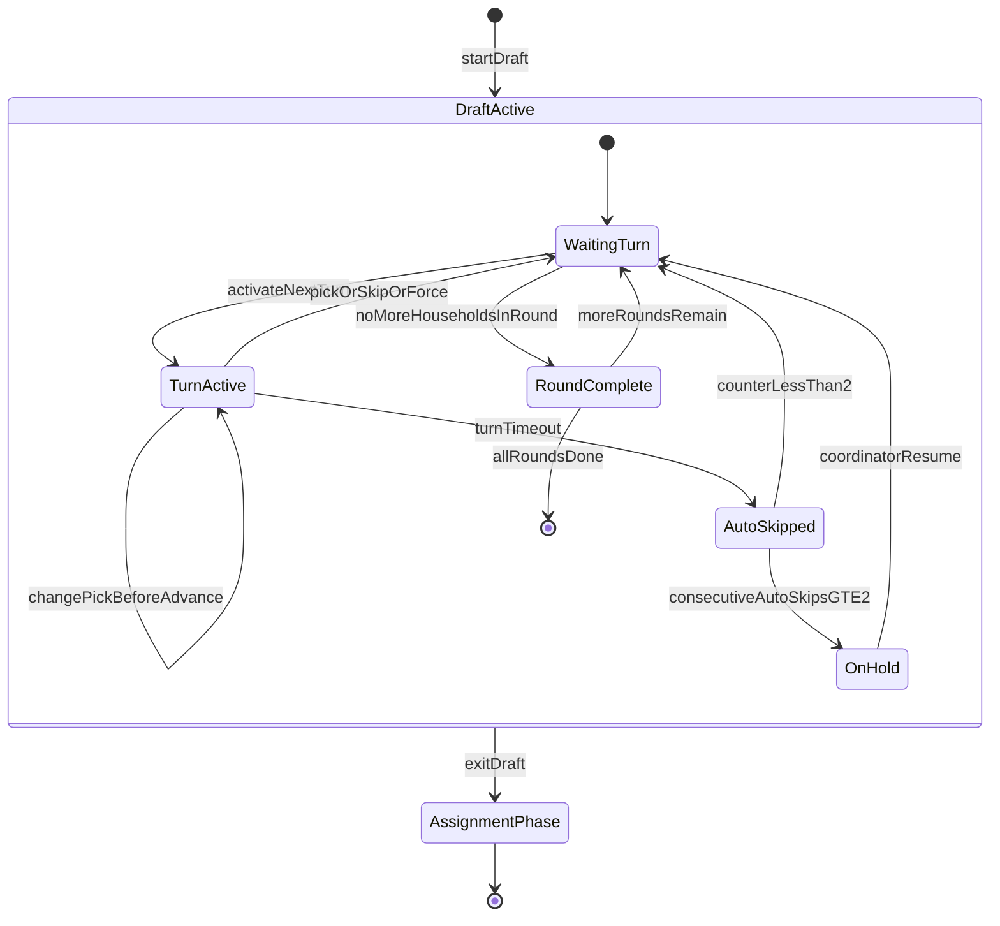
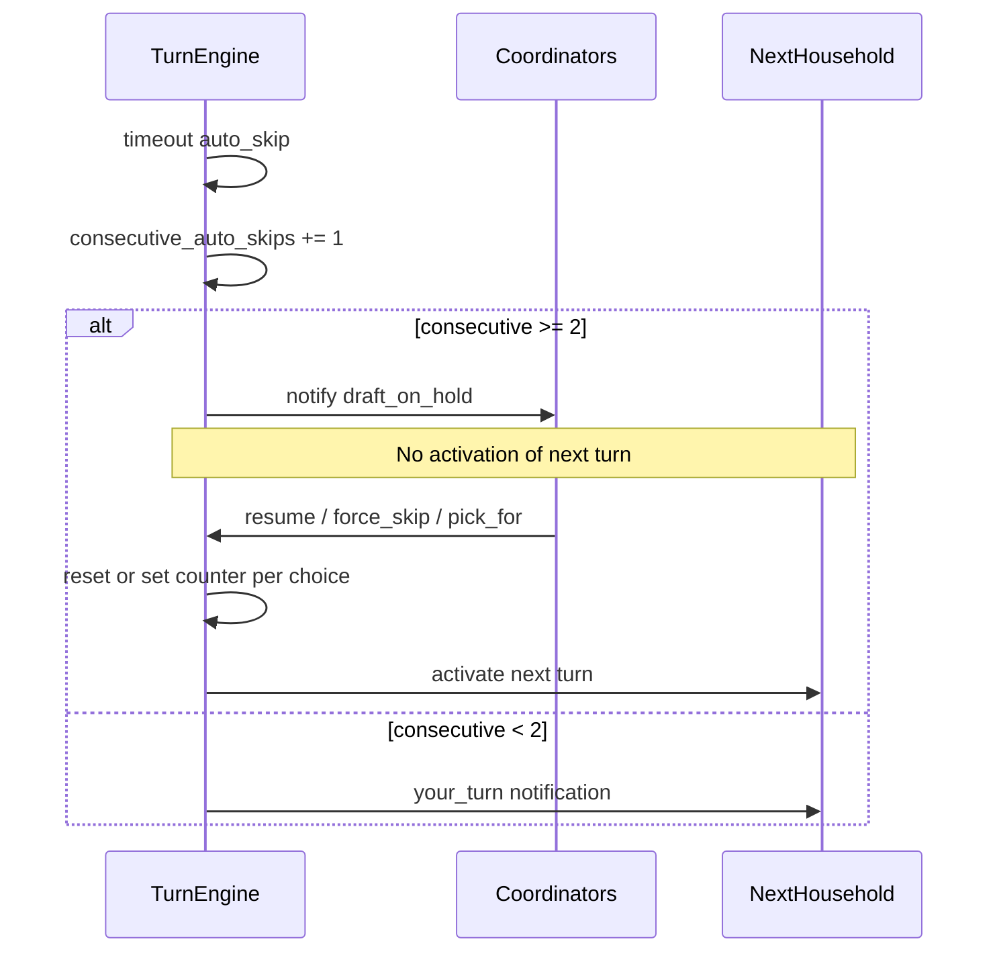
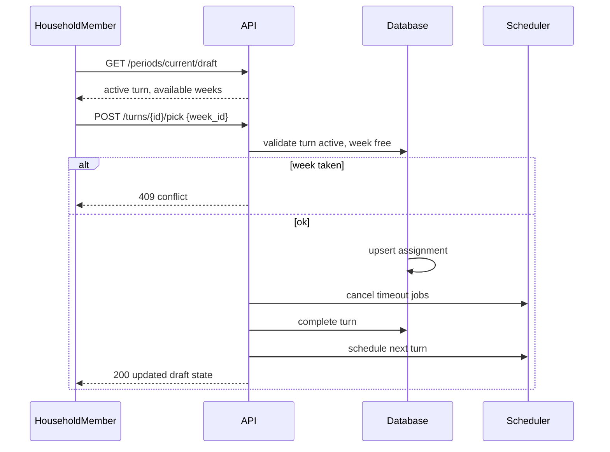
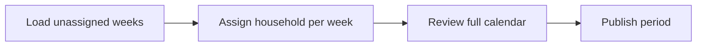
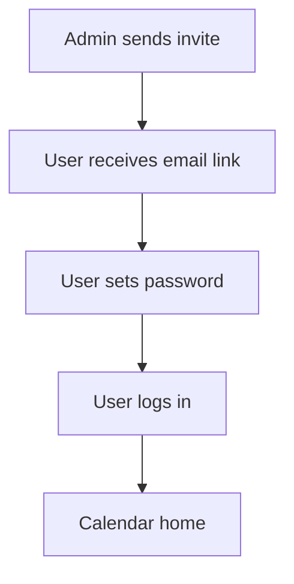

# Cabin Scheduling Application — System Workflows

This document describes end-to-end workflows, state machines, and notification triggers.

---

## 1. Period lifecycle (high level)

### 1.1 Phase behaviors

| Phase | User actions | System behavior |
|-------|--------------|-----------------|
| `scheduled` | Coordinators edit period; optional early view | Period visible to coordinators; notes optional policy: hidden until open (MVP: **visible read-only** to coordinators only, or hidden — implement as **not open** until opening) |
| `open` | All members: notes, occupancy | No draft picks; notify on opening |
| `draft` | Active household: pick/skip | Turn engine runs |
| `assignment` | Coordinator: assign weeks | Members read-only picks |
| `published` | Coordinator: edit assignments | Calendar authoritative |
| `archived` | Read-only | Notes/occupancy may hide per retention |

**MVP opening behavior:** At `opening_datetime`, transition to `open`; send **period_opened** notification to all users.

---

## 2. Draft state machine

### 2.1 Turn activation sequence

1. Load period `priority_order` for **active** households.
2. Determine current **round** (1..`week_selections_per_household`).
3. Select next household without a completed turn in this round.
4. Create `draft_turn` with `started_at`, `expires_at = started_at + pick_window_duration`.
5. Schedule jobs: **warning** at `expires_at - warning_lead_time`, **timeout** at `expires_at`.
6. Send **your_turn** notifications to all users in that household.

### 2.2 Turn completion

| Action | Result |
|--------|--------|
| `pick` | Create/update `assignment` source `draft_pick`; complete turn |
| `skip` | No assignment; complete turn |
| `auto_skip` | No assignment; `auto_skip=true`; increment `consecutive_auto_skips` |
| `coordinator_force_skip` | No assignment; reset or adjust counter per coordinator choice |
| `coordinator_pick_for` | Assignment with source `coordinator_manual` during draft |

After completion:

- If **hold** not active and more households in round → activate next turn.
- If round finished and more rounds → start next round at first priority household.
- If all rounds done → period state `assignment`.

### 2.3 Hold workflow

---

## 3. Pick / skip workflow (household member)

**Change pick:** Same endpoint while `turn.status = active` and household owns current turn; replace assignment before advance.

---

## 4. Coordinator assignment workflow

On publish:

- Set period `published_at`
- Notify all users **period_published**
- Lock draft structure (turns immutable)

Post-publish edit:

- Coordinator PATCH assignment → audit row → notify affected household **assignment_changed**

---

## 5. Notes workflow

- **Create:** Member selects date range on calendar → enters text → `POST /notes` with `household_id` from membership.
- **Visibility:** All authenticated users on calendar aggregate.
- **Edit/Delete:** Only if `note.household_id` matches user’s household.
- **Retention:** Cron or query filter hides notes where `end_date < today - retention_years`.

---

## 6. Occupancy workflow

- Member sets range + `green`|`red` → displays on calendar cells.
- No validation against assignments.
- Optional Nice-to-Have: API returns `overlap_assigned_other_household` flag for UI badge.

---

## 7. Notification triggers

| Event | Recipients | Channels | MVP |
|-------|------------|----------|-----|
| `period_opening_soon` | All users | email, in-app | Optional 24h before open |
| `period_opened` | All users | email, in-app | Yes |
| `draft_started` | All users | email, in-app | Yes |
| `your_turn` | Active household users | email, in-app | Yes |
| `turn_warning` | Active household users | email, in-app | Yes |
| `turn_auto_skipped` | Skipped household + next household | email, in-app | Yes |
| `draft_on_hold` | Coordinators | email, in-app | Yes |
| `draft_resumed` | All users | in-app | Yes |
| `draft_completed` | All users | in-app | Yes |
| `assignment_phase_started` | Coordinators | email, in-app | Yes |
| `period_published` | All users | email, in-app | Yes |
| `assignment_changed` | Affected household | email, in-app | Yes |

### 7.1 Background jobs

| Job | Schedule | Action |
|-----|----------|--------|
| `TurnWarningJob` | Once per turn at warning time | Emit `turn_warning` |
| `TurnTimeoutJob` | Once per turn at expiry | Auto-skip or hold |
| `PeriodOpenJob` | At opening datetime | Transition `scheduled`→`open` |
| `RetentionHideJob` | Daily | No-op on DB MVP; UI uses date filter |

Use a durable queue (e.g. Redis + worker, or DB-backed job table) so restarts do not lose timeouts.

---

## 8. User onboarding workflow

---

## 9. Household deactivation workflow

- Admin sets `household.active = false`.
- Remove from **future** period priority lists (coordinator prompted on save).
- If deactivation during active draft: coordinator must **force-skip** remaining turns or cancel draft (coordinator policy: **force-skip remaining** default).

---

## 10. Error and concurrency paths

| Scenario | Handling |
|----------|----------|
| Double pick same week | DB unique `(period_id, week_id)`; API 409 |
| Stale turn submit | Turn version/id mismatch → 410 Gone |
| Coordinator edits priority mid-draft | **Blocked** in MVP once draft started |
| Server clock skew | Use DB `now()` for expiry comparison |

---

## References

- [02-refined-requirements.md](./02-refined-requirements.md)
- [01-pick-model-decision.md](./01-pick-model-decision.md)
- [05-database-schema.md](./05-database-schema.md)
- [06-api-design.md](./06-api-design.md)
