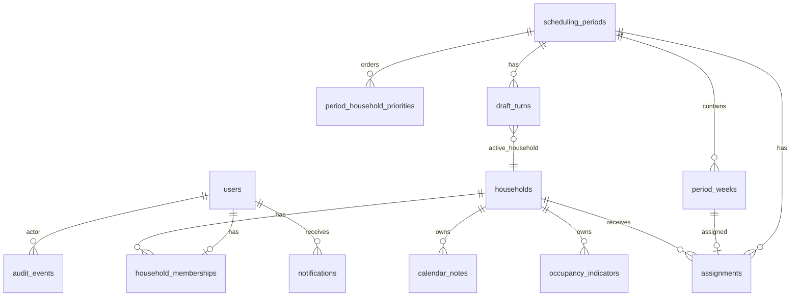

# Cabin Scheduling Application — Database Schema

**Database:** PostgreSQL 15+  
**Conventions:** `uuid` primary keys, `timestamptz` in UTC, soft-delete via `deleted_at` where noted.

---

## 1. Entity relationship overview



---

## 2. Tables

### 2.1 `households`

| Column | Type | Notes |
|--------|------|-------|
| `id` | uuid PK | |
| `name` | varchar(100) | Display name |
| `color` | char(7) | Hex `#RRGGBB` for calendar |
| `active` | boolean | Default true |
| `created_at` | timestamptz | |
| `updated_at` | timestamptz | |

### 2.2 `users`

| Column | Type | Notes |
|--------|------|-------|
| `id` | uuid PK | |
| `email` | citext unique | |
| `password_hash` | varchar | bcrypt/argon2 |
| `display_name` | varchar(100) | |
| `is_admin` | boolean | Default false |
| `is_coordinator` | boolean | Default false; max 3 enforced in app |
| `active` | boolean | |
| `email_verified_at` | timestamptz | |
| `created_at` | timestamptz | |
| `updated_at` | timestamptz | |

### 2.3 `household_memberships`

| Column | Type | Notes |
|--------|------|-------|
| `id` | uuid PK | |
| `user_id` | uuid FK → users | unique per user (one household) |
| `household_id` | uuid FK → households | |
| `created_at` | timestamptz | |

**Constraint:** `unique(user_id)` — one household per user.

### 2.4 `system_settings`

Singleton row or key-value store.

| Column | Type | Notes |
|--------|------|-------|
| `id` | smallint PK | Always `1` |
| `cabin_timezone` | varchar(64) | IANA |
| `week_start_day` | smallint | 0=Sun .. 6=Sat |
| `week_selections_per_household` | smallint | Default 1 |
| `pick_window_hours` | int | Default 72 |
| `pick_warning_lead_hours` | int | Default 12 |
| `history_retention_years` | int | Default 3 |
| `updated_at` | timestamptz | |
| `updated_by_user_id` | uuid FK | |

### 2.5 `scheduling_periods`

| Column | Type | Notes |
|--------|------|-------|
| `id` | uuid PK | |
| `name` | varchar(120) | e.g. "2026 Q1" |
| `start_date` | date | Cabin TZ civil date |
| `end_date` | date | Inclusive policy per requirements |
| `opening_at` | timestamptz | |
| `status` | enum | scheduled, open, draft, assignment, published, archived |
| `draft_started_at` | timestamptz | nullable |
| `published_at` | timestamptz | nullable |
| `consecutive_auto_skips` | smallint | Reset on coordinator resume (default 0) |
| `draft_on_hold` | boolean | |
| `current_round` | smallint | 1-based during draft |
| `created_by_user_id` | uuid FK | |
| `created_at` | timestamptz | |
| `updated_at` | timestamptz | |

**Index:** `(status)`, `(start_date, end_date)`

### 2.6 `period_weeks`

Materialized weeks for a period (computed on period save).

| Column | Type | Notes |
|--------|------|-------|
| `id` | uuid PK | |
| `scheduling_period_id` | uuid FK | |
| `week_start_date` | date | Anchor in cabin TZ |
| `week_end_date` | date | Computed: start + 6 days |
| `sort_order` | int | Chronological |

**Constraint:** `unique(scheduling_period_id, week_start_date)`

### 2.7 `period_household_priorities`

Draft order per period.

| Column | Type | Notes |
|--------|------|-------|
| `id` | uuid PK | |
| `scheduling_period_id` | uuid FK | |
| `household_id` | uuid FK | |
| `position` | int | 1 = first pick |

**Constraint:** `unique(scheduling_period_id, household_id)`, `unique(scheduling_period_id, position)`

### 2.8 `assignments`

| Column | Type | Notes |
|--------|------|-------|
| `id` | uuid PK | |
| `scheduling_period_id` | uuid FK | |
| `period_week_id` | uuid FK | |
| `household_id` | uuid FK | |
| `source` | enum | draft_pick, coordinator_manual, coordinator_edit |
| `draft_turn_id` | uuid FK | nullable |
| `created_at` | timestamptz | |
| `updated_at` | timestamptz | |

**Constraint:** `unique(period_week_id)` — exclusive week.

### 2.9 `draft_turns`

| Column | Type | Notes |
|--------|------|-------|
| `id` | uuid PK | |
| `scheduling_period_id` | uuid FK | |
| `household_id` | uuid FK | |
| `round` | smallint | |
| `position_in_round` | int | Copy from priority for audit |
| `status` | enum | pending, active, completed |
| `action` | enum | nullable: pick, skip, auto_skip, coordinator_skip, coordinator_pick |
| `period_week_id` | uuid FK | nullable; week picked |
| `acted_by_user_id` | uuid FK | nullable |
| `started_at` | timestamptz | |
| `expires_at` | timestamptz | |
| `completed_at` | timestamptz | |
| `client_action_id` | uuid | Idempotency nullable |

**Index:** `(scheduling_period_id, status)`, `(expires_at) WHERE status = 'active'`

### 2.10 `calendar_notes`

| Column | Type | Notes |
|--------|------|-------|
| `id` | uuid PK | |
| `household_id` | uuid FK | |
| `start_date` | date | |
| `end_date` | date | |
| `body` | text | |
| `created_by_user_id` | uuid FK | Audit only |
| `created_at` | timestamptz | |
| `updated_at` | timestamptz | |

**Index:** `(start_date, end_date)`

### 2.11 `occupancy_indicators`

| Column | Type | Notes |
|--------|------|-------|
| `id` | uuid PK | |
| `household_id` | uuid FK | |
| `start_date` | date | |
| `end_date` | date | |
| `status` | enum | green, red |
| `created_by_user_id` | uuid FK | |
| `created_at` | timestamptz | |
| `updated_at` | timestamptz | |

### 2.12 `invites`

| Column | Type | Notes |
|--------|------|-------|
| `id` | uuid PK | |
| `email` | citext | |
| `household_id` | uuid FK | |
| `token_hash` | varchar | |
| `expires_at` | timestamptz | |
| `accepted_at` | timestamptz | |
| `invited_by_user_id` | uuid FK | |

### 2.13 `notifications`

| Column | Type | Notes |
|--------|------|-------|
| `id` | uuid PK | |
| `user_id` | uuid FK | |
| `type` | varchar(50) | e.g. your_turn |
| `title` | varchar(200) | |
| `body` | text | |
| `payload` | jsonb | period_id, turn_id, etc. |
| `read_at` | timestamptz | |
| `created_at` | timestamptz | |

**Index:** `(user_id, read_at, created_at DESC)`

### 2.14 `audit_events`

| Column | Type | Notes |
|--------|------|-------|
| `id` | uuid PK | |
| `actor_user_id` | uuid FK | |
| `event_type` | varchar(50) | |
| `entity_type` | varchar(50) | |
| `entity_id` | uuid | |
| `before` | jsonb | |
| `after` | jsonb | |
| `reason` | text | nullable |
| `created_at` | timestamptz | |

### 2.15 `password_reset_tokens`

| Column | Type | Notes |
|--------|------|-------|
| `id` | uuid PK | |
| `user_id` | uuid FK | |
| `token_hash` | varchar | |
| `expires_at` | timestamptz | |
| `used_at` | timestamptz | |

### 2.16 `scheduled_jobs` (optional MVP table)

Durable turn timers if not using external queue only.

| Column | Type | Notes |
|--------|------|-------|
| `id` | uuid PK | |
| `job_type` | varchar | turn_warning, turn_timeout, period_open |
| `run_at` | timestamptz | |
| `payload` | jsonb | |
| `completed_at` | timestamptz | |

---

## 3. Key queries

### 3.1 Calendar aggregate (month view)

For `month_start`, `month_end`:

- `period_weeks` joined to `assignments` and `households` for weeks overlapping range
- `calendar_notes` where ranges overlap month
- `occupancy_indicators` where ranges overlap month and `start_date >= retention_cutoff`
- Active `scheduling_periods` overlapping month for status banner

### 3.2 Available weeks for pick

```sql
SELECT pw.*
FROM period_weeks pw
LEFT JOIN assignments a ON a.period_week_id = pw.id
WHERE pw.scheduling_period_id = :period_id
  AND a.id IS NULL
ORDER BY pw.sort_order;
```

### 3.3 Current active turn

```sql
SELECT * FROM draft_turns
WHERE scheduling_period_id = :id AND status = 'active'
LIMIT 1;
```

---

## 4. Migrations strategy

- Use migration tool (Flyway, Alembic, or Prisma migrate) from day one.
- Seed: one admin user, five households (optional dev seed), default `system_settings`.

---

## 5. Future schema considerations

- `cabins` table for multi-tenancy (not MVP)
- `swap_requests` table (non-goal)
- `user_notification_preferences` (Nice-to-Have)
- Materialized view `calendar_month_cache` if performance requires

---

## References

- [06-api-design.md](./06-api-design.md)
- [02-refined-requirements.md](./02-refined-requirements.md)
