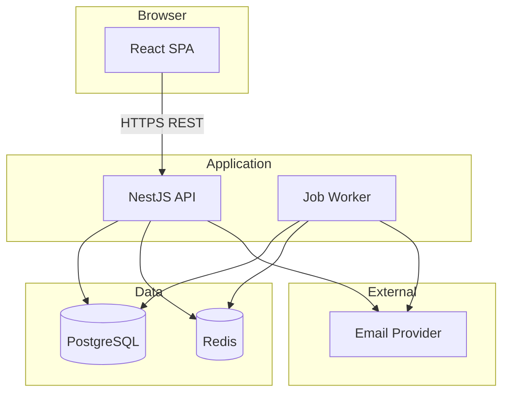
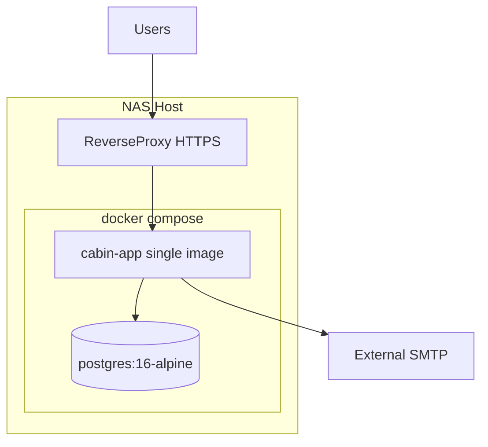

# Cabin Scheduling Application — Technology Stack

Recommendations optimized for a **small, trusted user base**, **calendar-heavy reads**, **turn-based writes**, and **background scheduling** (timeouts, email).

---

## 1. Recommended stack (primary)

| Layer | Choice | Rationale |
|-------|--------|-----------|
| **Frontend** | React 19 + TypeScript + Vite | Familiar ecosystem; component model fits calendar UI |
| **UI** | Tailwind CSS + headless primitives (Radix) | Fast, accessible calendar and modals without heavy design system |
| **Calendar UI** | Custom month grid + week detail drawer | Full control over assignments, notes, occupancy layers (FullCalendar optional if speed > customization) |
| **Backend** | Node.js 22 + **NestJS** (or Fastify if team prefers lighter) | Structured modules for draft engine, auth, jobs |
| **ORM** | Prisma | Migrations, type-safe queries, PostgreSQL-first |
| **Database** | PostgreSQL 15+ | Relational integrity for exclusive week constraint, audit |
| **Cache / queue** | Redis 7 | Session store, BullMQ job delays for turn warnings/timeouts |
| **Email** | Resend or SendGrid | Transactional templates for turn notifications |
| **Hosting** | Fly.io, Railway, or Render | Low ops for single cabin; managed Postgres + Redis |
| **CI** | GitHub Actions | Test, lint, migrate on deploy |

**Classification:** All MVP-viable with incremental complexity.

**Implementation note:** This repository targets **self-hosted Docker on a NAS** (see §9). The implemented backend is **Fastify** (not NestJS), with **no Redis** — Postgres-backed sessions and in-process scheduling.

---

## 2. Alternative stacks (acceptable)

### 2.1 Python path

- **FastAPI** + SQLAlchemy 2 + Alembic + Celery (Redis)
- **Frontend:** Same React SPA
- **When:** Team stronger in Python than TypeScript backend

### 2.2 Full-stack TypeScript simplification

- **Next.js 15** (App Router) — API routes + React UI in one deploy
- **Prisma** + Postgres; **Vercel Cron** or Inngest for turn timers
- **When:** Minimize repos and ops; acceptable coupling for single cabin

### 2.3 .NET path

- **ASP.NET Core 8** + EF Core + Hangfire (SQL Server/Postgres)
- **When:** Team is .NET-centric

---

## 3. Architecture diagram



---

## 4. Cross-cutting concerns

### 4.1 Authentication

- **MVP:** Server-side sessions (Redis-backed) + bcrypt password hashing
- Session cookie: `Secure`, `HttpOnly`, `SameSite=Lax`
- CSRF token for cookie-based mutations

### 4.2 Background jobs

- On turn activation: enqueue `TurnWarningJob` and `TurnTimeoutJob` with delay
- On period create: enqueue `PeriodOpenJob` at `opening_at`
- Worker idempotency: job payload includes `turn_id`; skip if turn already completed

### 4.3 Week computation

- Implement in shared module (used by API on period save):
  - Input: `start_date`, `end_date`, `week_start_day`, `cabin_timezone`
  - Output: list of `week_start_date` per boundary rules in requirements
- Unit test heavily (DST, period boundary)

### 4.4 Email templates

- HTML + plain text; variables: household name, week dates, deep link to calendar/draft
- Deep links: `/calendar?date=YYYY-MM-DD` and `/periods/{id}/draft`

### 4.5 Observability

- Structured logging (pino/winston)
- Error tracking: Sentry (Nice-to-Have for MVP, recommended before production)
- Health: `GET /health` for DB + Redis

---

## 5. What to avoid for MVP

| Temptation | Why skip |
|------------|----------|
| Microservices | Single cabin, ~25 users max |
| GraphQL | REST calendar aggregate is simpler |
| Mobile native apps | Responsive web sufficient |
| Multi-region | Unnecessary cost |
| Custom auth protocol | Use battle-tested session + invite flow |

---

## 6. Repository layout (suggested)

```
scheduling_app/
  apps/
    web/          # React SPA
    api/          # NestJS (or server/)
  packages/
    shared/       # Week computation, types, constants
  prisma/
    schema.prisma
    migrations/
  docs/
    planning/
```

Monorepo with **pnpm workspaces** or single Next.js repo — team preference.

---

## 7. Testing strategy

| Level | Focus |
|-------|-------|
| Unit | Week computation, draft state transitions, auto-skip/hold |
| Integration | API pick/skip concurrency, unique week constraint |
| E2E | Playwright: one full draft path with 3 households |

---

## 8. Security checklist (MVP)

- HTTPS everywhere
- Password hashing (argon2id or bcrypt)
- Rate limit login and forgot-password
- Role guards on all mutating routes
- Coordinator cap (3) enforced in service layer
- No PII in logs beyond user id

---

## 9. Self-hosted deployment (Docker / NAS) — selected for this project

Optimized for a **single compose stack** on Synology, QNAP, or similar: low RAM, no managed cloud services, TLS via the NAS reverse proxy.

### 9.1 Target topology



| Component | Choice | Notes |
|-----------|--------|-------|
| **Containers** | `app` + `db` | Two services only |
| **App image** | Node 22 + Fastify | API + static React build in one image |
| **Database** | PostgreSQL 16 Alpine | Named volume on NAS; backup via volume snapshot |
| **Sessions** | Postgres `sessions` table | No Redis |
| **Job scheduling** | `node-cron` in API process (Phase 3+) | Poll `draft_turns.expires_at` or use `pg-boss` later |
| **Email** | External SMTP env vars | Gmail relay, Mailgun, etc. — do not run Postfix on NAS |
| **TLS** | NAS reverse proxy | Container listens HTTP on internal port |

### 9.2 Deliberately omitted on NAS

- Redis, BullMQ, separate worker container
- NestJS (heavier memory footprint)
- Vercel Cron / Inngest / Fly.io / Railway

### 9.3 ARM and resources

- Use official multi-arch images (`node:22-bookworm-slim`, `postgres:16-alpine`).
- Allocate **512MB–1GB** to `app`, **256MB+** to Postgres for ~25 users.
- Set `restart: unless-stopped` on both services.

### 9.4 Operations checklist

- [ ] `docker compose up -d` with `.env` (secrets, `DATABASE_URL`, `SESSION_SECRET`, SMTP)
- [ ] Reverse proxy: host → `app:3000`, WebSocket not required for MVP
- [ ] Volume backup for `postgres_data`
- [ ] Run migrations on deploy: `prisma migrate deploy` in entrypoint or one-off job
- [ ] Optional: LAN-only or Tailscale; avoid exposing admin endpoints publicly without auth

### 9.5 SQLite alternative

If Postgres on NAS is undesirable, SQLite + single file volume is viable at this scale (**one app instance only**). Current codebase uses **Postgres**; switching would be a Prisma datasource change, not a product change.

---

## References

- [06-api-design.md](./06-api-design.md)
- [08-roadmap-and-mvp.md](./08-roadmap-and-mvp.md)
- Repository: `docker-compose.yml`, `Dockerfile`, `apps/api`, `apps/web`
