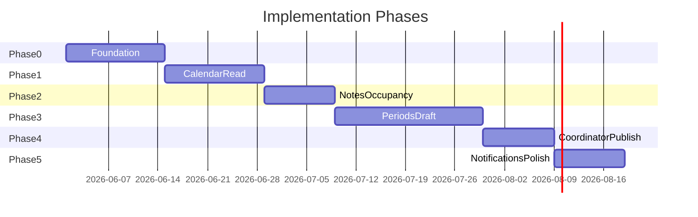

# Cabin Scheduling Application — Roadmap and MVP Definition

---

## 1. MVP definition

### 1.1 Goal

Deliver a **single-cabin**, **calendar-first** web application that lets ~5 households **view** assignments, notes, and occupancy indicators, and **complete one full scheduling period** via round-based sequential draft (default one pick per household), coordinator assignment of remaining weeks, and published calendar — with **email and in-app notifications** for critical scheduling events.

### 1.2 In scope (MVP)

| Capability | Included |
|------------|----------|
| Calendar month view + week detail | Yes |
| Household notes (date range) | Yes |
| Green/red occupancy indicators | Yes |
| Scheduling periods (create, open, draft, assign, publish) | Yes |
| Round-based draft, timeouts, warnings, auto-skip, 2-strike hold | Yes |
| Coordinator: priority, resume hold, force-skip, assign remainder, edit after publish | Yes |
| Assignment audit log | Yes |
| Users: invite, email/password, forgot password | Yes |
| Roles: Member, Coordinator (≤3), Admin | Yes |
| Settings: TZ, week start, pick window, warning lead, selections/household (default 1), retention | Yes |
| Notifications: email + in-app | Yes |
| Rolling history (retention years) | Yes |

### 1.3 Out of scope (MVP)

- Chat, voting, swaps, payments, maintenance, reservation queues
- Automatic assignment / fairness engine
- Multi-cabin tenancy
- OAuth, SMS
- iCal export
- Representative-only picks
- Draft pause (without hold)
- SSE / real-time (polling acceptable)
- Full activity feed (assignment audit only)

### 1.4 Success criteria

1. **Draft integrity:** Five households complete a period with **zero double-booked weeks** (DB constraint + API 409).
2. **Timeout path:** Auto-skip, consecutive hold after two auto-skips, coordinator resume — verified in integration/E2E tests.
3. **Onboarding:** New user accepts invite and views calendar in **under 5 minutes** (manual test script).
4. **Read-heavy UX:** Calendar loads month view in **< 2 seconds** on typical home broadband.
5. **Transparency:** Post-publish assignment change creates audit record and notifies affected household.

### 1.5 MVP release gate

- [ ] One production scheduling period dry-run with coordinators
- [ ] Email deliverability verified (SPF/DKIM on sending domain)
- [ ] Backup/restore tested for Postgres
- [ ] Coordinator runbook documented (hold, resume, assign remainder)

---

## 2. Phased implementation roadmap

*Dates are illustrative — adjust to team capacity.*

---

### Phase 0: Foundation (2 weeks) — **implemented**

**Objective:** Runnable app skeleton, auth, data model.

**Repository:** `apps/api`, `apps/web`, `docker-compose.yml`, see root [README.md](../../README.md).

| Deliverable | Stories / FR |
|-------------|----------------|
| Monorepo, CI, Postgres, Prisma schema | — |
| Migrations for core tables | [05-database-schema.md](./05-database-schema.md) |
| Auth: login, logout, invite accept, forgot password | AUTH-* |
| Admin: households, users, settings seed | ADM-01–04 |
| Health check, environments | NFR-* |

**Exit:** Admin can invite user; user logs in; empty calendar shell.

---

### Phase 1: Calendar read (2 weeks)

**Objective:** Primary screen delivers value before draft exists.

| Deliverable | Stories |
|-------------|---------|
| `GET /calendar` aggregate | CAL-01, CAL-02, CAL-05 |
| Month grid with week assignment display (manual seed data OK) | CAL-01 |
| Period status banner (static/seeded) | CAL-03 |
| Week detail drawer | CAL-04 |

**Exit:** Members browse months and see seeded assignments.

---

### Phase 2: Notes and occupancy (1.5 weeks) — **implemented**

**Objective:** Informational layers on calendar.

| Deliverable | Stories |
|-------------|---------|
| Notes CRUD | NOTE-* |
| Occupancy CRUD + disclaimer | OCC-01–03 |
| Retention filter on notes/occupancy | FR-NOTE-04 |

**Exit:** Households annotate calendar; data appears on aggregate endpoint.

---

### Phase 3: Periods and draft engine (3 weeks)

**Objective:** Core scheduling differentiation.

| Deliverable | Stories |
|-------------|---------|
| Period CRUD + week computation | PER-* |
| Priority order | PER-03 |
| Start draft, turn activation | DRF-01, DRF-02 |
| Pick / skip / change before advance | DRF-03–05 |
| BullMQ warning + timeout jobs | DRF-06–07 |
| Auto-skip + hold + coordinator resume | DRF-08–09 |
| Draft UI on calendar banner | CAL-03 |

**Exit:** End-to-end draft with 3+ test households in staging.

---

### Phase 4: Coordinator assignment and publish (1.5 weeks)

**Objective:** Close the period lifecycle.

| Deliverable | Stories |
|-------------|---------|
| Unassigned weeks list | ASN-01 |
| Manual assign + publish | ASN-02–03 |
| Post-publish edit + audit | ASN-04–05 |
| Period open job at `opening_at` | Workflows §7 |

**Exit:** Published period shows complete assignment set on calendar.

---

### Phase 5: Notifications and polish (1.5 weeks)

**Objective:** Production-ready comms and hardening.

| Deliverable | Stories |
|-------------|---------|
| In-app notification inbox | NTF-01 |
| Email templates for all MVP events | NTF-02, Workflows §7 |
| E2E: full period happy path + hold path | — |
| Responsive pass on calendar | — |
| Security: rate limits, CSRF | NFR-04 |

**Exit:** MVP release gate checklist complete.

---

## 3. Post-MVP phases

### Phase 6: Nice-to-Have batch (as needed)

| Item | Est. |
|------|------|
| iCal export | 2–3 days |
| Occupancy overlap highlight | 2 days |
| Draft pause | 3 days |
| Email notification preferences | 2 days |
| Mobile week strip | 3–5 days |
| SSE draft updates | 3 days |

### Phase 7: Future (explicit backlog)

- Multi-cabin tenancy
- Auto-assignment suggestions
- OAuth providers
- SMS notifications
- Swap/vote/chat (only if product direction changes)

---

## 4. Risk register

| Risk | Mitigation |
|------|------------|
| Draft stall confusion | Clear banner + coordinator runbook |
| Users expect green/red to be enforceable | Persistent informational copy |
| Email spam | Batch non-critical; Nice-to-Have opt-out |
| DST week bugs | Unit tests in shared week module |
| Coordinator bottleneck | Up to 3 coordinators; force-skip/resume tools |

---

## 5. Document index

| # | Document |
|---|----------|
| 01 | [Pick model decision](./01-pick-model-decision.md) |
| 02 | [Refined requirements](./02-refined-requirements.md) |
| 03 | [User stories](./03-user-stories.md) |
| 04 | [System workflows](./04-system-workflows.md) |
| 05 | [Database schema](./05-database-schema.md) |
| 06 | [API design](./06-api-design.md) |
| 07 | [Technology stack](./07-technology-stack.md) |
| 08 | [Roadmap and MVP](./08-roadmap-and-mvp.md) (this document) |

---

## References

- Phase 1 planning Q&A (2026-05-30)
- [02-refined-requirements.md](./02-refined-requirements.md)
